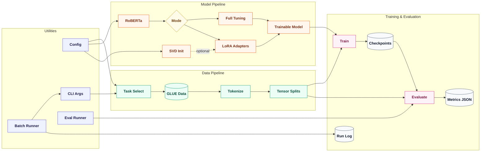

# Fine-Tuning Large Language Models Using LoRA

**Authors**: Maryna Ohinska, Daryna Antoniuk, Olha Kaplysh

## Videos

- [Maryna Ohinska](https://www.youtube.com/watch?v=U9YXA9MURvw&t=11s)
- [Daryna Antoniuk](https://youtu.be/YGIefP0QRbI)
- [Olha Kaplysh](https://youtu.be/cY6yw76rKeA?si=DNGYE5uHM5STgnHp)

Linear Algebra project focused on implementing Low-Rank Adaptation (LoRA) for fine-tuning RoBERTa. The project explores the mathematical foundations of parameter-efficient training through low-rank matrix decomposition, rank-performance trade-offs, and singular value analysis on GLUE tasks.

The main aim is to analyse and implement efficient fine-tuning of a large language model using the LoRA method, with an emphasis on how low-rank matrix decompositions reduce the number of trainable parameters while preserving model performance. Model quality is evaluated on tasks from the GLUE benchmark, including sentiment classification, textual entailment, sentence similarity, and linguistic acceptability.

## Project tasks

1. Study the architecture of large language models (Transformers, self-attention).
2. Analyse standard full fine-tuning as a baseline.
3. Implement LoRA fine-tuning on RoBERTa.
4. Evaluate performance against full fine-tuning on GLUE.

## Supported tasks

- SST-2
- MRPC
- CoLA
- MNLI

## Method overview

LoRA reduces the number of trainable parameters by representing the update of a weight matrix as a low-rank decomposition `ΔW = BA`. In this project, LoRA is applied to the query and value projection matrices in RoBERTa attention layers, while the original pretrained weights remain frozen.

## Pipeline



1. **Data Loading**
   - Purpose: Load the selected GLUE task dataset.
   - Input: task name from config or CLI
   - Output: raw train, validation, and test splits

2. **Preprocessing**
   - Purpose: Convert text into model-ready tensors.
   - Input: raw dataset and tokenizer
   - Output: tokenized tensors with input IDs, attention masks, and labels

3. **Model Setup**
   - Purpose: Build the classifier and choose full fine-tuning or LoRA.
   - Input: model config, task labels, mode, rank, and alpha
   - Output: RoBERTa classifier prepared for training

4. **LoRA Transformation**
   - Purpose: Replace full dense updates with a low-rank update `ΔW = BA`.
   - Input: frozen weight matrix `W`, rank `r`, and scaling factor `alpha`
   - Output: trainable low-rank matrices `A` and `B`

5. **Optional SVD Initialization**
   - Purpose: Initialize LoRA adapters from dominant singular directions when enabled.
   - Input: frozen base weights and SVD settings
   - Output: structured low-rank adapter initialization

6. **Training**
   - Purpose: Fine-tune the model on the selected task.
   - Input: train/evaluation splits and training config
   - Output: checkpoints and run log

7. **Evaluation**
   - Purpose: Evaluate saved checkpoints on the validation split.
   - Input: checkpoint, task config, and evaluation split
   - Output: metrics JSON files

In full fine-tuning, the model learns updates across the original parameter space. In LoRA fine-tuning, the update to a dense matrix is constrained to a rank-`r` factorization: `ΔW = BA`, where `A` projects into a smaller subspace and `B` maps back to the original dimension. This makes the rank a direct linear algebra control over capacity, memory use, and trainable parameter count.

With truncated SVD initialization, the adapter starts from the strongest singular directions of the frozen weight matrix. This gives the low-rank update a structured basis aligned with the geometry of the pretrained model, instead of starting only from random adapter weights.

## Project structure

```bash
LoRA_LA_project/
├── configs/
│   └── train.yaml
├── scripts/
│   ├── run_finetuning.py
│   └── evaluate_checkpoints.sh
├── src/
│   ├── config.py         # config loader
│   ├── data.py           # GLUE loading and tokenization
│   ├── evaluate.py       # evaluate an already fine-tuned checkpoint
│   ├── lora.py           # LoRA logic
│   └── train.py          # train experiments
├── README.md
├── requirements.txt
├── LICENSE
└── .gitignore
```

## Installation

```bash
python3 -m venv venv
source venv/bin/activate
pip install -r requirements.txt
```

## Example usage

```bash
python src/train.py --task sst2 --mode full
python src/train.py --task sst2 --mode lora --rank 8
python src/evaluate.py --task sst2 --checkpoint_path outputs/sst2_full_r8/checkpoint-12630
```

Run a reusable batch of fine-tuning jobs:

```bash
python scripts/run_finetuning.py --tasks sst2 mrpc --rank-sweep 4 8 16 32
```

Evaluate all saved checkpoints:

```bash
bash scripts/evaluate_checkpoints.sh
```

## Evaluation

The project compares LoRA and full fine-tuning in terms of:

- accuracy on GLUE tasks,
- number of trainable parameters,
- GPU memory usage,
- throughput.

## Planned experiments

- Full fine-tuning baseline on RoBERTa-base.
- LoRA fine-tuning with ranks `r in {4, 8, 16, 32}`.
- Rank-sensitivity analysis.
- SVD-based LoRA initialization with `pretraining_mode: truncated_svd`.
